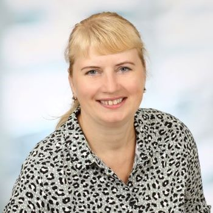

# **Katerina Manzhak**
-------------------------------------------------

### *Contacts:*  
### mobile: +380503258226
### e-mail: manzhak.katerina@gmail.com
### Discord RS School: Katerina#9997
-------------------------------------------------
#### **Personal qualities:** Conscientious, communicative, determined, diligent, creative, eager to learn 
-------------------------------------------------
#### **Special skills:** 
##### * *Language skills* – English - Upper-Intermediate, Russian - Native, Ukrainian – Native, German – Intermediate, French – basic knowleage.
##### * *Computer literacy* – Microsoft Office, Archicad, Delphy, Html, Css, JS, Photoshop, Figma, Illustrator, 1C:Enterprise, Social Media marketing.
##### * *Driving license* – Category B
##### * *Hobbies* – foreign languages, programming, traveling
-------------------------------------------------
#### **Work experience:**
##### Preparing business plans, Analyzing data, Preparing reports.
##### Work with databases (1C, Microsoft Access), web-information, design programs (Photoshop, Illustrator), website development (Html, css), website support (php, C#), development of a hotel heating program (Delphy), supply of equipment, correspondence with suppliers in foreign languages, development and management of ads (Google Adwords / Adsense, Facebook, Instagram).
-------------------------------------------------
#### **Education:**
##### 1. *Kharkiv Technical University of Radioelectronics*
#####    September 1991 – May 1996
#####    Systems Engineer Developer, Specialist’s degree
##### 2. *Kharkiv Polytechnical University*
#####    September 1993 – May 1996
#####    Patent Specialist Marketer, Specialist’s degree
##### 3. *Kharkiv Pedagogical University*
#####    September 2019 – December 2020
#####    Teacher of English Languages, Master’s degree
-------------------------------------------------
#### **Qualifications:**
##### * English Courses (Kharkiv English language school - YES) – 2017 – 2022 (C1-level)
##### * English Language Certificate (B2), 2018
##### * German Language Certificate (B1), 2023
##### * Certificate, Course "Basics Web UI Development 2022", 2022
##### * Certificate RS School, Course "JavaScript/Front-end. Stage 0", 2023
-------------------------------------------------
##### Example of code from codewars:
##### const assert = require("chai").assert;
##### describe("Multiply", () => {
#####   it("fixed tests", () => {
#####     assert.strictEqual(multiply(1,1), 1);
#####     assert.strictEqual(multiply(2,1), 2);
#####     assert.strictEqual(multiply(2,2), 4);
#####     assert.strictEqual(multiply(3,5), 15);   
#####   });
##### });
-------------------------------------------------
### My first project is https://manzhakkaterina.github.io/rsschool-cv/cv
-------------------------------------------------
-------------------------------------------------
